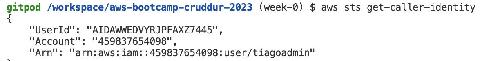

# Week 0 — Billing and Architecture

## Summary submitted in Student Portal

I started off this week by (re)watching and following all the playlist course videos, which provided me with a solid foundation for my learning. I used the root account user to create an IAM group and an IAM user, with admin privileges. Setting up MFA in both users was an important security measure that I implemented, and I've also created access keys to use that user in gitpod.

Creating a Billing Alarm using SNS topic and Cloudwatch is an essential step in keeping track of my costs. It's great to see that I also created an AWS Budget, both in the AWS console and in the terminal.

Reviewing all the questions of each pillar in the Well Architected Tool shows that I am in the right path to obtain a good understanding of the principles of AWS architecture. 

Drawing the required diagrams in Lucid Charts was a challenging task, but is a great way for me to visualize my system architecture.

Researching the technical and service limits of specific services is an important step in ensuring that my system is technically flexible, and opening a support ticket to request a service limit shows that I am willing to take proactive measures to ensure my system is scalable.

Overall, I have accomplished a great deal during this first week of the bootcamp. I will continue to keep up the good work!

--------


## Required Homework/Tasks

### Install and Verify AWS CLI in Gitpod

I've been using Gitpod in bootcamp, as previously recommended by Andrew.

I've followed the instructions on the video [Week 0 - Generate Credentials, AWS CLI, Budget and Billing Alarm via CLI]( https://www.youtube.com/watch?v=OdUnNuKylHg&list=PLBfufR7vyJJ7k25byhRXJldB5AiwgNnWv&index=16).

In order to prove that I am able to use the AWS CLI and the IAM access key is set in Gitpod, here are the screenshot of command `aws sts get-caller-identity` in Gitpod:



----------------

I followed the instructions on the [AWS CLI Install Documentation Page](https://docs.aws.amazon.com/cli/latest/userguide/getting-started-install.html)


```
msiexec.exe /i https://awscli.amazonaws.com/AWSCLIV2.msi
```

I attempted to run the command by typing in `aws` but I recieved an error

```
C:\Users\Andrew>aws
'aws' is not recognized as an internal or external command,
operable program or batch file.
```

I was able to resolve the error by closing command prompt, and opening it again.


### Create a Budget

I created my own Budget for $1 because I cannot afford any kind of spend.
I did not create a second Budget because I was concerned of budget spending going over the 2 budget free limit.

 

### Recreate Logical Architectural Deisgn


[Lucid Charts Share Link](https://lucid.app/lucidchart/c6d54586-0334-44ab-95cb-d11772edcace/edit?viewport_loc=-259%2C144%2C2219%2C1161%2C0_0&invitationId=inv_19e0767b-5aa5-49ec-bccd-f220b9163d2f
)

## Example of Referncing a file in the codebase

Example of me of referencing a file in my repo
[week-1-again/aws/json/alarm-config.jso](https://github.com/omenking/aws-bootcamp-cruddur-2023/blob/week-1-again/aws/json/alarm-config.json)


--------

<div style="width: 640px; height: 480px; margin: 10px; position: relative;"><iframe allowfullscreen frameborder="0" style="width:640px; height:480px" src="https://lucid.app/documents/embedded/594dbcda-c1ab-4623-a120-cb08fe136f8c" id="qIoyDAsjqI5r"></iframe></div>

URL: https://lucid.app/documents/view/594dbcda-c1ab-4623-a120-cb08fe136f8c

## Getting the AWS CLI Working

We'll be using the AWS CLI often in this bootcamp,
so we'll proceed to installing this account.


### Install AWS CLI

- We are going to install the AWS CLI when our Gitpod enviroment lanuches.
- We are are going to set AWS CLI to use partial autoprompt mode to make it easier to debug CLI commands.
- The bash commands we are using are the same as the [AWS CLI Install Instructions]https://docs.aws.amazon.com/cli/latest/userguide/getting-started-install.html


Update our `.gitpod.yml` to include the following task.

```sh
tasks:
  - name: aws-cli
    env:
      AWS_CLI_AUTO_PROMPT: on-partial
    init: |
      cd /workspace
      curl "https://awscli.amazonaws.com/awscli-exe-linux-x86_64.zip" -o "awscliv2.zip"
      unzip awscliv2.zip
      sudo ./aws/install
      cd $THEIA_WORKSPACE_ROOT
```

We'll also run these commands indivually to perform the install manually

### Create a new User and Generate AWS Credentials

- Go to (IAM Users Console](https://us-east-1.console.aws.amazon.com/iamv2/home?region=us-east-1#/users) andrew create a new user
- `Enable console access` for the user
- Create a new `Admin` Group and apply `AdministratorAccess`
- Create the user and go find and click into the user
- Click on `Security Credentials` and `Create Access Key`
- Choose AWS CLI Access
- Download the CSV with the credentials

### Set Env Vars

We will set these credentials for the current bash terminal
```
export AWS_ACCESS_KEY_ID=""
export AWS_SECRET_ACCESS_KEY=""
export AWS_DEFAULT_REGION=us-east-1
```

We'll tell Gitpod to remember these credentials if we relaunch our workspaces
```
gp env AWS_ACCESS_KEY_ID=""
gp env AWS_SECRET_ACCESS_KEY=""
gp env AWS_DEFAULT_REGION=us-east-1
```

### Check that the AWS CLI is working and you are the expected user

```sh
aws sts get-caller-identity
```

You should see something like this:
```json
{
    "UserId": "AIFBZRJIQN2ONP4ET4EK4",
    "Account": "655602346534",
    "Arn": "arn:aws:iam::655602346534:user/andrewcloudcamp"
}
```

## Enable Billing 

We need to turn on Billing Alerts to recieve alerts...


- In your Root Account go to the [Billing Page](https://console.aws.amazon.com/billing/)
- Under `Billing Preferences` Choose `Receive Billing Alerts`
- Save Preferences


## Creating a Billing Alarm

### Create SNS Topic

- We need an SNS topic before we create an alarm.
- The SNS topic is what will delivery us an alert when we get overbilled
- [aws sns create-topic](https://docs.aws.amazon.com/cli/latest/reference/sns/create-topic.html)

We'll create a SNS Topic
```sh
aws sns create-topic --name billing-alarm
```
which will return a TopicARN

We'll create a subscription supply the TopicARN and our Email
```sh
aws sns subscribe \
    --topic-arn TopicARN \
    --protocol email \
    --notification-endpoint your@email.com
```

Check your email and confirm the subscription

#### Create Alarm

- [aws cloudwatch put-metric-alarm](https://docs.aws.amazon.com/cli/latest/reference/cloudwatch/put-metric-alarm.html)
- [Create an Alarm via AWS CLI](https://aws.amazon.com/premiumsupport/knowledge-center/cloudwatch-estimatedcharges-alarm/)
- We need to update the configuration json script with the TopicARN we generated earlier
- We are just a json file because --metrics is is required for expressions and so its easier to us a JSON file.

```sh
aws cloudwatch put-metric-alarm --cli-input-json file://aws/json/alarm_config.json
```

## Create an AWS Budget

[aws budgets create-budget](https://docs.aws.amazon.com/cli/latest/reference/budgets/create-budget.html)

Get your AWS Account ID
```sh
aws sts get-caller-identity --query Account --output text
```

- Supply your AWS Account ID
- Update the json files
- This is another case with AWS CLI its just much easier to json files due to lots of nested json

```sh
aws budgets create-budget \
    --account-id AccountID \
    --budget file://aws/json/budget.json \
    --notifications-with-subscribers file://aws/json/budget-notifications-with-subscribers.json
```


----

# Week 0 — Billing and Architecture

## Required Homework/Tasks

### Install and Verify AWS CLI 

I was not able to use Gitpod or Github Codespaces due to browser issues.
So I decided to use a local enviroment.

In order to prove that I am able to use the AWS CLI.
I am providing the instructions I used for my configuration of my local machine on windows.

I did the following steps to install AWS CLI.

I installed the AWS CLI for Windows 10 via command in **Command Prompt**:

I followed the instructions on the [AWS CLI Install Documentation Page](https://docs.aws.amazon.com/cli/latest/userguide/getting-started-install.html)


```
msiexec.exe /i https://awscli.amazonaws.com/AWSCLIV2.msi
```

I attempted to run the command by typing in `aws` but I recieved an error

```
C:\Users\Andrew>aws
'aws' is not recognized as an internal or external command,
operable program or batch file.
```

I was able to resolve the error by closing command prompt, and opening it again.


### Create a Budget

I created my own Budget for $1 because I cannot afford any kind of spend.
I did not create a second Budget because I was concerned of budget spending going over the 2 budget free limit.

 

### Recreate Logical Architectural Deisgn


[Lucid Charts Share Link](https://lucid.app/lucidchart/c6d54586-0334-44ab-95cb-d11772edcace/edit?viewport_loc=-259%2C144%2C2219%2C1161%2C0_0&invitationId=inv_19e0767b-5aa5-49ec-bccd-f220b9163d2f
)

## Example of Referncing a file in the codebase

Example of me of referencing a file in my repo
[week-1-again/aws/json/alarm-config.jso](https://github.com/omenking/aws-bootcamp-cruddur-2023/blob/week-1-again/aws/json/alarm-config.json)

## List Example

- This
- Is 
- A
- List

1. This
2. Is
3. A 
3. Ordered 
4. List

## Table Example

| My | Cool | Table |
| --- | --- | ---|
| Hello | World | ! |

## Code Example

```json
{
  "AlarmName": "DailyEstimatedCharges",
  "AlarmDescription": "This alarm would be triggered if the daily estimated charges exceeds 1$",
  "ActionsEnabled": true,
  "AlarmActions": [
      "arn:aws:sns:ca-central-1:***REMOVED***:billing-alarm"
  ],
  "EvaluationPeriods": 1,
  "DatapointsToAlarm": 1,
  "Threshold": 1,
  "ComparisonOperator": "GreaterThanOrEqualToThreshold",
  "TreatMissingData": "breaching",
  "Metrics": [{
      "Id": "m1",
      "MetricStat": {
          "Metric": {
              "Namespace": "AWS/Billing",
              "MetricName": "EstimatedCharges",
              "Dimensions": [{
                  "Name": "Currency",
                  "Value": "USD"
              }]
          },
          "Period": 86400,
          "Stat": "Maximum"
      },
      "ReturnData": false
  },
  {
      "Id": "e1",
      "Expression": "IF(RATE(m1)>0,RATE(m1)*86400,0)",
      "Label": "DailyEstimatedCharges",
      "ReturnData": true
  }]
}
```
