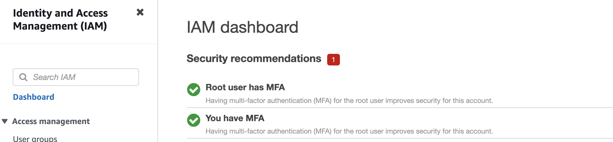
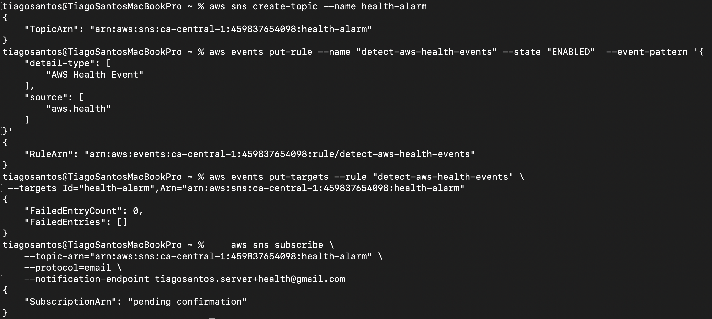
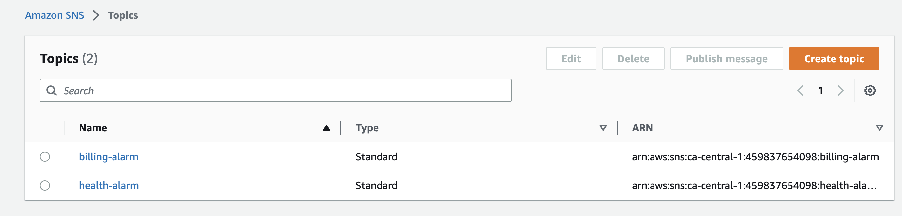
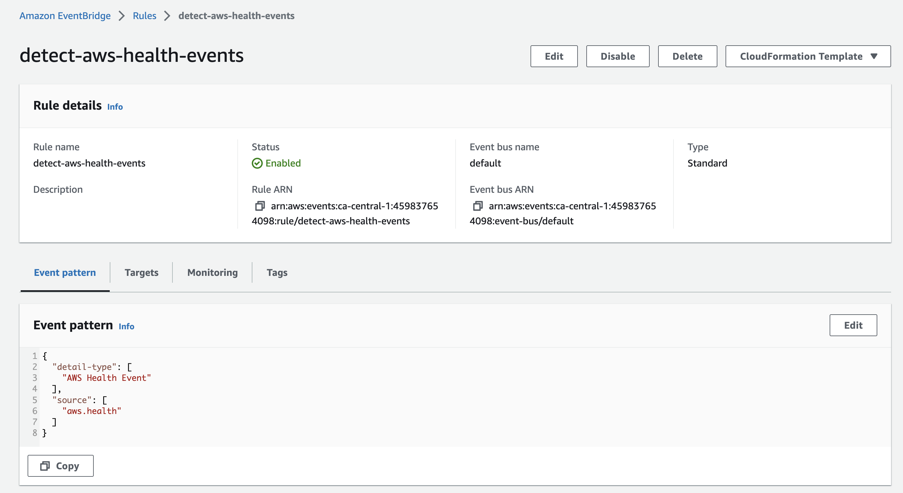
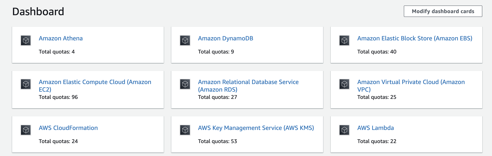
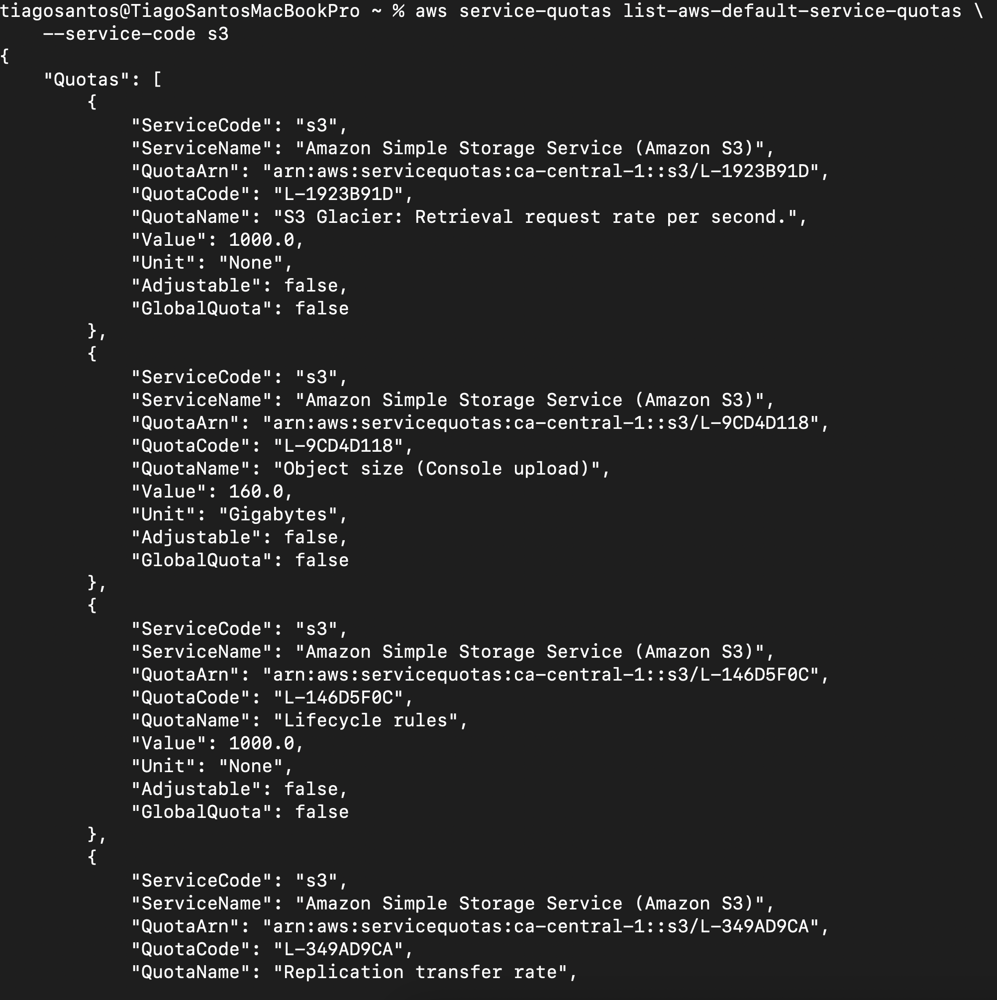
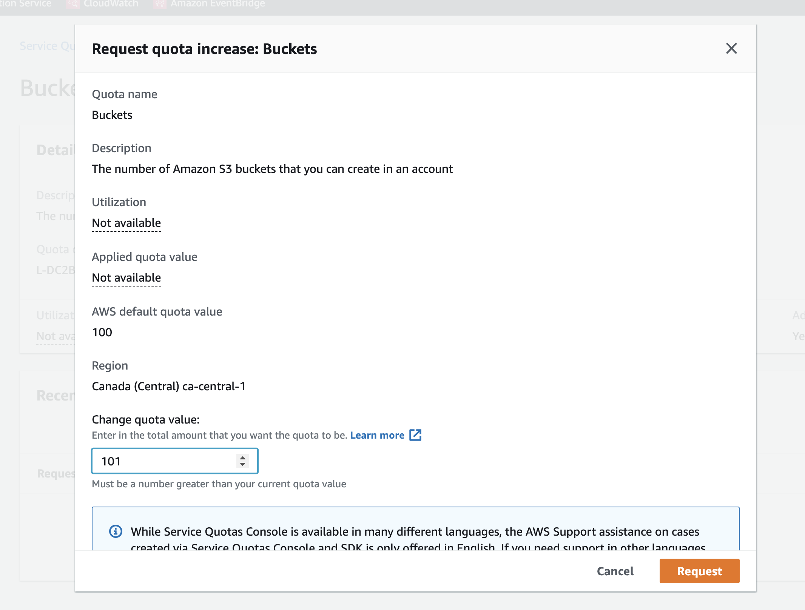
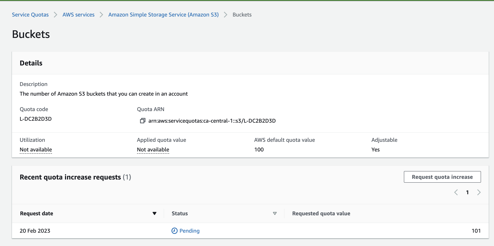
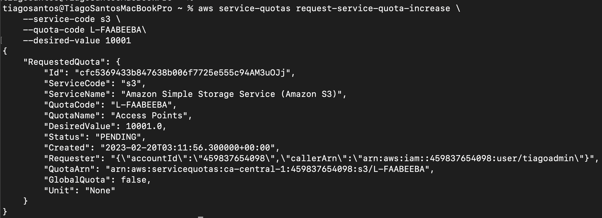
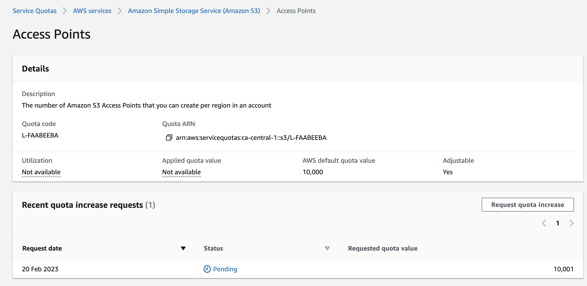

# Week 0 — Billing and Architecture (journal under construction)

## Summary submitted in Student Portal

I started off this week by (re)watching and following all the playlist course videos, which provided me with a solid foundation for my learning. I used the root account user to create an IAM group and an IAM user, with admin privileges. Setting up MFA in both users was an important security measure that I implemented, and I've also created access keys to use that user in gitpod.

Creating a Billing Alarm using SNS topic and Cloudwatch is an essential step in keeping track of my costs. It's great to see that I also created an AWS Budget, both in the AWS console and in the terminal.

Reviewing all the questions of each pillar in the Well Architected Tool shows that I am in the right path to obtain a good understanding of the principles of AWS architecture. 

Drawing the required diagrams in Lucid Charts was a challenging task, but is a great way for me to visualize my system architecture.

Researching the technical and service limits of specific services is an important step in ensuring that my system is technically flexible, and opening a support ticket to request a service limit shows that I am willing to take proactive measures to ensure my system is scalable.

Overall, I have accomplished a great deal during this first week of the bootcamp. I will continue to keep up the good work!

--------


## Required Homework/Tasks

### Create a new IAM user (and a group) and set MFA on it

- I signed up with root user in my AWS account, created an IAM group called and attached a determined policy to it. 
- I create a user and assigned it to the previously created group.
- I activate MFA on it and created an Access Key to use on Gitpod.

### Install and Verify AWS CLI in Gitpod

I've been using Gitpod in bootcamp, as previously recommended by Andrew.

I've followed the instructions on the video [Week 0 - Generate Credentials, AWS CLI, Budget and Billing Alarm via CLI]( https://www.youtube.com/watch?v=OdUnNuKylHg&list=PLBfufR7vyJJ7k25byhRXJldB5AiwgNnWv&index=16).

### Install AWS CLI

- I installed the AWS CLI when the Gitpod enviroment lanuches.
- I tested the commands in terminal according to [AWS CLI Install Instructions]https://docs.aws.amazon.com/cli/latest/userguide/getting-started-install.html
- I updated `.gitpod.yml` to include the following task.

```sh
tasks:
  - name: aws-cli
    env:
      AWS_CLI_AUTO_PROMPT: on-partial
    init: |
      cd /workspace
      curl "https://awscli.amazonaws.com/awscli-exe-linux-x86_64.zip" -o "awscliv2.zip"
      unzip awscliv2.zip
      sudo ./aws/install
      cd $THEIA_WORKSPACE_ROOT
```

### Set Env Vars

I set these credentials for the current bash terminal to test if it worked.
```
export AWS_ACCESS_KEY_ID=""
export AWS_SECRET_ACCESS_KEY=""
export AWS_DEFAULT_REGION=us-east-1
```

And then, I've persisted them on Gitpod to remember these credentials when I relaunch the workspaces
```
gp env AWS_ACCESS_KEY_ID=""
gp env AWS_SECRET_ACCESS_KEY=""
gp env AWS_DEFAULT_REGION=us-east-1
```

Besides that, I've also checked my account ID and saved it on gitpod as previously mentioned for the other variables:

```sh
aws sts get-caller-identity --query Account --output text
```

```
gp env AWS_ACCOUNT_ID=(my account ID)
```

### Check that the AWS CLI is working and you are the expected user

In order to prove that I am able to use the AWS CLI and the IAM access key is set in Gitpod, here are the screenshot of command `aws sts get-caller-identity` in Gitpod:


### Enable Billing, create budget and create a billing alarm

In order to receive billing alerts, I've turned on Billing Alerts in AWS Console.

I open my Root Account go to the [Billing Page](https://console.aws.amazon.com/billing/), went to `Billing Preferences` -> `Receive Billing Alerts` and saved it.

### Create a Budget

I created my own Budget for $1 on console first and then created another in Gitpod as suggested by Andrew.

In order to do that, I created these 2 files:

- [budget.json](https://github.com/tiagomqsantos/aws-bootcamp-cruddur-2023/tree/main/aws/json/budget.json)
- [budget-notifications-with-subscribers.json](https://github.com/tiagomqsantos/aws-bootcamp-cruddur-2023/tree/main/aws/json/budget-notifications-with-subscribers.json)

Then, I put this in the terminal:

```sh
aws budgets create-budget \
    --account-id $AWS_ACCOUNT_ID \
    --budget file://aws/json/budget.json \
    --notifications-with-subscribers file://aws/json/budget-notifications-with-subscribers.json

[aws budgets create-budget](https://docs.aws.amazon.com/cli/latest/reference/budgets/create-budget.html)
```

In order to prove that I did that, here are the screenshot of AWS Billing -> Budget in AWS Console:


### Create SNS Topic

- Before create an alarm I had to set an SNS Topic.
- I read the documentation, present in[aws sns create-topic](https://docs.aws.amazon.com/cli/latest/reference/sns/create-topic.html).
- To create the SNS Topic, I run in the terminal the following command to create the SNS Topic:

```sh
aws sns create-topic --name billing-alarm
```
which returned the ARN of the SNS topic.

After that, I created a subscription supply of the refered sns topic and my email
```sh
    aws sns subscribe \
    --topic-arn="arn:aws:sns:ca-central-1:459837654098:billing-alarm" \
    --protocol=email \
    --notification-endpoint tiagosantos.server+billing@gmail.com
```


Last, I checked my email and confirmed the subscription.

### Creating a Billing Alarm

- [aws cloudwatch put-metric-alarm](https://docs.aws.amazon.com/cli/latest/reference/cloudwatch/put-metric-alarm.html)
- [Create an Alarm via AWS CLI](https://aws.amazon.com/premiumsupport/knowledge-center/cloudwatch-estimatedcharges-alarm/)
- We need to update the configuration json script with the TopicARN we generated earlier
- We are just a json file because --metrics is is required for expressions and so its easier to us a JSON file.

```sh
aws cloudwatch put-metric-alarm --cli-input-json file://aws/json/alarm_config.json
```

 

### Recreate Logical Architectural Deisgn


[Lucid Charts Cruddur Logical Diagram Link](https://lucid.app/documents/view/594dbcda-c1ab-4623-a120-cb08fe136f8c)

## Homework Challenges

### Destroy your root account credentials, Set MFA, IAM role

As mentioned above, I already create another user with admin permissions. 
Before that I already had set MFA on root user too as a security best practice.
With that, I have MFA set on both root user and in the user that I use in gitpod.



### Use EventBridge to hookup Health Dashboard to SNS and send notification when there is a service health issue.

I used the info on [Detect and Notify on AWS Personal Health Dashboard Events](https://asecure.cloud/a/detect-aws-health-events/) as reference.

First I will create an SNS Topic (This is similar to the one that I did above for billing alert):

```sh
aws sns create-topic --name health-alarm
```
which returned the ARN of the SNS topic.

After that, I created a subscription supply of the refered sns topic and my email:

```sh
    aws sns subscribe \
    --topic-arn="arn:aws:sns:ca-central-1:459837654098:health-alarm" \
    --protocol=email \
    --notification-endpoint tiagosantos.server+health@gmail.com
```

Then I created the Event Bridge rule for AWS Health:

```sh
aws events put-rule --name "detect-aws-health-events" --state "ENABLED"  --event-pattern '{
    "detail-type": [
        "AWS Health Event"
    ],
    "source": [
        "aws.health"
    ]
}'
```

Last, I set the SNS Topic as the target of the rule:
```sh
aws events put-targets --rule "detect-aws-health-events" \
 --targets Id="health-alarm",Arn="arn:aws:sns:ca-central-1:459837654098:health-alarm"
```

To confirm this, here are the screenshots of commands in terminal and the result on AWS Console Regarding the SNS Topic and the Rule on EventBridge:





### Review all the questions of each pillars in the Well Architected Tool (No specialized lens)

Info: [AWS Well-Architected Tool FAQs](https://aws.amazon.com/well-architected-tool/faqs/)
Done

### Create an architectural diagram (to the best of your ability) the CI/CD logical pipeline in Lucid Charts

### Research the technical and service limits of specific services and how they could impact the technical path for technical flexibility. 

Info: [AWS service quotas](https://docs.aws.amazon.com/general/latest/gr/aws_service_limits.html)

I watched the info in the AWS Console and played some commands in the terminal.





### Open a support ticket and request a service limit

In AWS Console I requested a new limit for `The number of Amazon S3 buckets that you can create in an account (L-DC2B2D3D)` (L-FAABEEBA), from 100 to 101.





I used the info found on [request-service-quota-increase¶](https://docs.aws.amazon.com/cli/latest/reference/service-quotas/request-service-quota-increase.html) to request new quotas on S3 buckets via AWS CLI.

With the terminal I requested a new limit for quota `The number of Amazon S3 Access Points that you can create per region in an account (L-FAABEEBA)`, from 10000 to 10001.



